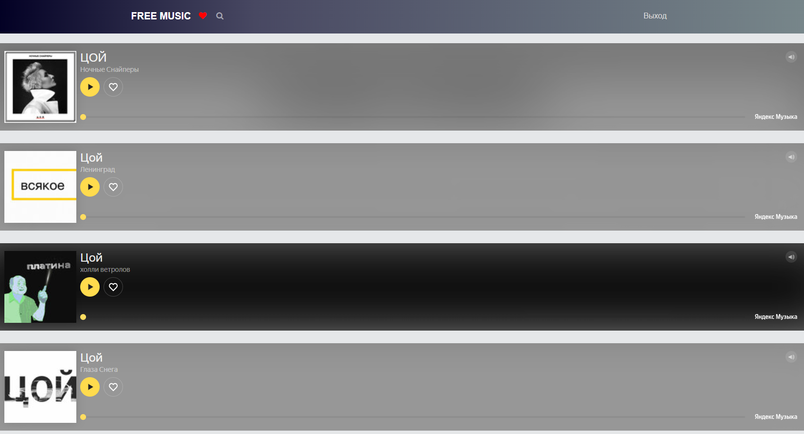
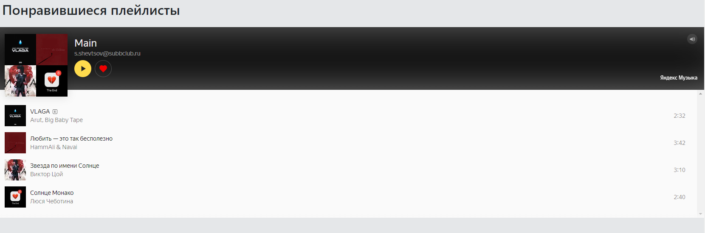

# yandex-music-api

A set of classes for working wit Yandex-music api

Just transfer the folder to the server


Change the connection in `vendor/db.php`


`R::setup( 'mysql:host=127.0.0.1;dbna=db,'root', 'root' );`

Then you can launch the site and log in from your Yandex account


The account connection is in `src/set_account`

All classes for working with the api are in `src/client.php`

Example of a music search request

```html
$search = $_GET['search']
$result = $client->search($search, false,'all',0)
$trcks_search = $result->tracks->results;`
```

```html
 <?php include 'src/search.php'; ?>
        <?php /** @var  $tracks_search */
        foreach ($tracks_search as $track) { ?>
            <div style="margin-top: 20px">
                <iframe frameborder="0" style="border:none;width:100%;height:180px;" width="100%" height="180"
                        src="https://music.yandex.ru/iframe/#track/<?= $track->id ?>/<?= $track->albums[0]->id ?>">
                    Слушайте
                    <a
                            href='https://music.yandex.ru/album/<?= $track->albums[0]->id ?>/track/<?= $track->id ?>'>ЦОЙ</a>
                    —
                    <a
                            href='https://music.yandex.ru/artist/<?= $track->artists[0]->id ?>'>Ночные Снайперы</a>
                </iframe>
            </div>
        <?php } ?>
    <?php } ?>
```


Output of the account playlist


get_user_likes.php


```html
$playlist = $client->usersPlaylistsList()

```
client.php


```html
 public function usersPlaylistsList() {
        $url = $this->baseUrl."/users/".$this->account->uid."/playlists/list";

        $response = json_decode($this->get($url))->result;

        return $response;
    }
```


wishlist.php


```html
foreach ($playlist as $track) {
        ?>
        <div style="margin-top: 20px">
            <iframe frameborder="0" style="border:none;width:100%;height:450px;" width="100%" height="450"
                    src="https://music.yandex.ru/iframe/#playlist/<?= $track->uid ?>/<?= $track->kind ?>">Слушайте <a
                        href='https://music.yandex.ru/users/<?= $track->uid ?>/playlists/<?= $track->kind ?>'>test</a> — <a
                        href='https://music.yandex.ru/users/<?= $track->uid ?>'><?= $_SESSION['logged_user']['email'] ?></a> на Яндекс
                Музыке
            </iframe>
        </div>
    <?php } ?>
```




